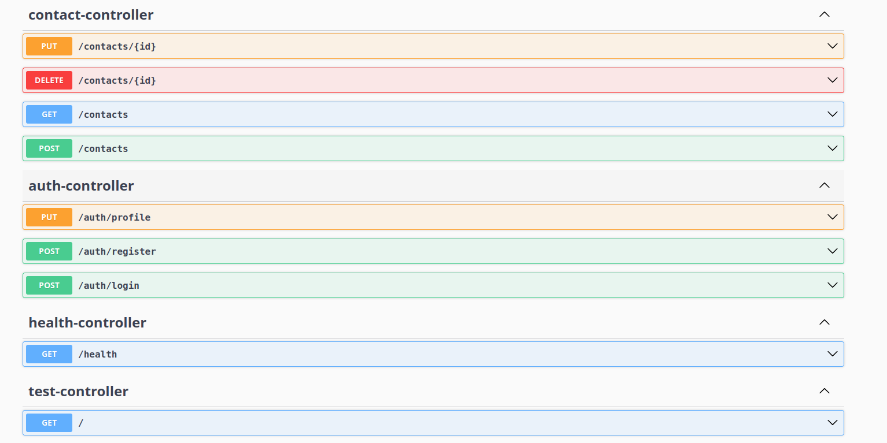

## Project Title
 Contact record keeping app

 ## Project Overview
This is a full-stack Contact Record Management Application.
The backend is developed using Spring Boot and the frontend is built using Angular.
The application allows users to register, login, and manage their personal contacts securely.
 
 ## Project Structure 

 There are two folders in CONTACT RECORD APP
 - backend -> Backend is built using Spring boot.
 - Contact-app Front -> frontend -> Frontend is built using Angular 

 ## Technology Stack 

 ### Frontend
- Angular
- Bootstrap

### Backend
- Java
- Spring Boot
- PostgreSQL
- JWT Authentication
- Swagger (OpenAPI)

### Tools
- Maven
- Node.js & npm

## Features

- User Registration & Login
- JWT-based Authentication
- Add / Update / Delete Contacts
- View Contact List
- Update User Profile
- Swagger API Documentation

## API Documentation

Swagger (OpenAPI 3.0) is used for API documentation and API testing.

Swagger UI URL:
http://localhost:8081/swagger-ui/index.html
Like this:-

## Installation and Setup

### Prerequisites
- Java 17+
- Maven
- Node.js
- PostgreSQL

### Backend Setup
1. Navigate to backend folder
   cd backend
2. Configure database in application.properties
3. Run the Spring Boot application
4. Backend will start on port 8081

### Frontend Setup
1. Navigate to frontend folder
   cd 'Contact-app Front' and then 
   cd frontend
2. Install dependencies
   npm install
3. Start Angular application
   npm start
4. Frontend will start on port 4200

## Authentication Flow

1. User logs in using authentication APIs
2. A JWT token is generated on successful login
3. The token must be sent in the Authorization header for secured APIs

Example: Authorization: Bearer <JWT_TOKEN>

## Conclusion

This project covers backend and frontend integration with proper API documentation using Swagger.
